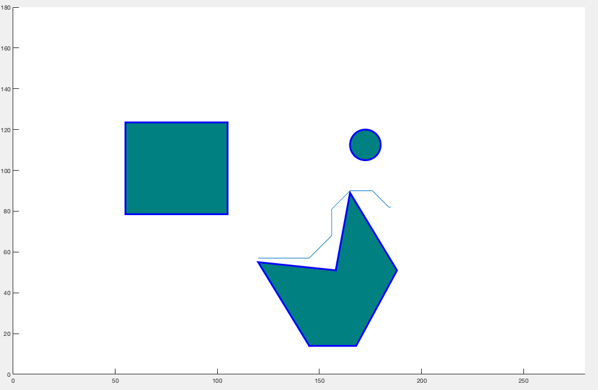

# A Star Algorithm - Path Planning

This repository contains a Python implementation of an A Star algorithm for shortest path finding in an environment with static obstacles. The obstacles are hardcoded as a set of polygons, triangles and circles inside the algorithm inside the `class Obstacles`. You can easily create your own obstacles by modiying this class. The obstacle bounds checking is done by using half planes, slopes and intercepts concepts. The A Star algorithm involves calculation of two costs for every new node (cost to go and cost to come). Using these two costs, the total cost for reaching a node from any given node is calculated. The nodes are grown in eight directions from any given node and the total costs for all the newly generated nodes are calculated. Finally, when we arrive at our destination node, the algorithm terminates. We maintain a dictionary of all the generated nodes and then use the principle of backtracking from tail to head to get the shortest path. The visualization is done separately by using the provided MATLAB script. 

# Dependencies for running the code
- MATLAB
- Python 2.7 Interpreter
- Any CSV file viewer like Microsoft Excel, Google Sheets, Libre Office, etc.

# How to run the algorithm ?

- First run the file `A_Star_Algorithm.py`
- When the algorithm finishes perfectly, you will see the nodes being generated in `A_Star_Algorithm_Nodes.csv`
- Finally, run the MATLAB script `Visualization_Script.m`

# Visualization of the Shortest Path Generated from the Algorithm

